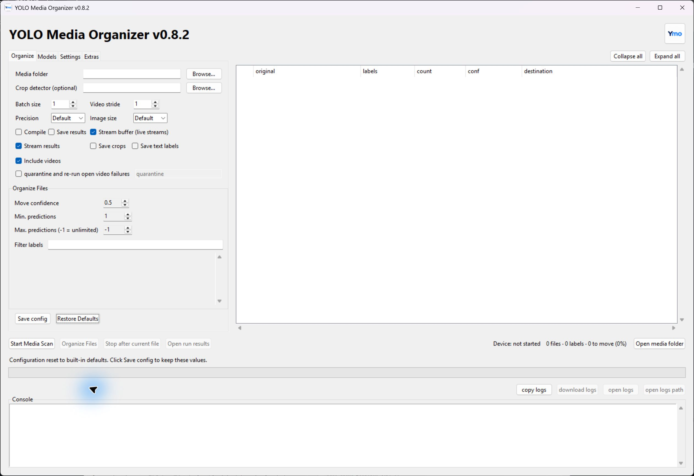

<p align="center">
  
</p>

<h1 align="center">YOLO Media Organizer</h1>
<p align="center">
  Moves images & video using YOLO-based models into label folders.
</p>

<p align="center">
  <a href="https://github.com/electblake/YOLO-media-organizer/releases/latest"></a>
  <a href="LICENSE"></a>
  <a href="#installer"></a>
</p>



---

## Installer

[Download the latest installer (Windows)](https://github.com/electblake/YOLO-media-organizer/releases/latest)

Choose CPU or NVIDIA GPU during setup. Installer will download Python and dependencies. GPU mode requires an NVIDIA driver compatible with CUDA 13.0.

## Run from source

```powershell
uv sync --group cpu/--group gpu
uv run yolo-media-organizer
```

## Build the Windows installer

Requires PowerShell 7 and Inno Setup 6.7.3.

```powershell
./scripts/build-setup.ps1
```

The installer is written to `dist/`.

## Documentation

- [Models](Models.md)
- [Changelog](CHANGELOG.md)

## License

Licensed under the [MIT License](LICENSE).

## Disclaimer

This project is not affiliated with Ultralytics or the [YOLO models](https://docs.ultralytics.com/models). For more information, see the [Ultralytics documentation](https://docs.ultralytics.com) and [Ultralytics website](https://www.ultralytics.com).
